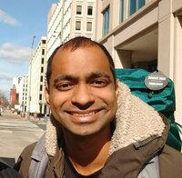

# Apurva Nakade 

 

**Pronunciation** : [əpuɾʋə nakade](https://en.wikipedia.org/wiki/Help:IPA/Marathi)  
**Contact info** : [Here](https://www.uwo.ca/math/people/postdocs.html)  
**Résumé**: [CV] (Updated on: December 24, 2020)  
**Currently teaching** : [Algebraic Topology](https://owl.uwo.ca/portal/site/1fda099f-409e-45c6-ba83-c81bf40a4798) 
 

I\'m a postdoc at the [University of Western Ontario] working with [Dan Christensen] and [Chris Kapulkin]. 
My research is in the areas of algebraic topology and homotopy theory.

My interests lie somewhere in the intersection (or union?) of math research, math education, and programming.
I am very passionate about improving math education and want to modernize it and bring it to the 21st century through the use of new technological innovations 
in teaching, and in the process make it more accessible and equitable.

  [University of Western Ontario]: http://www.math.uwo.ca/ 
  [Dan Christensen]: https://jdc.math.uwo.ca/ 
  [Chris Kapulkin]: http://www.math.uwo.ca/faculty/kapulkin/
  [CV]: https://drive.google.com/file/d/1gjjdAYYkMuSBC6xEMi96PKej3IxA25VC/view?usp=sharing
  [Research Statement (video)]: https://youtu.be/rlyzT1PWw5I
  [DRP]: https://www.math.uwo.ca/undergraduate/directed_reading_program.html 
  [Teaching Portfolio]: teaching-portfolio/

