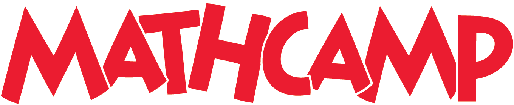

<!-- # Mathcamp -->
<h1 id="Mathcamp">
    <a href="#Mathcamp" class="header">
        Canada/USA  
    </a>
</h1>

## Lean at MC2020

[Notes.](https://apurvanakade.github.io/courses/lean_at_MC2020/index.html)

I taught this week long class at Mathcamp 2020 introducing students to the Lean theorem prover.
The class is completely interactive - you learn by solving exercises and coding snippets online.
The only prerequisites for this class are basic proof techniques, although it is recommended that you simultaneously use the other resources linked in the notes.
Towards the end of the class we teach Lean the proof of irrationality of \\( \sqrt{2} \\).

## Crash Course on Linear Algebra

[Notes.](https://github.com/apurvnakade/mc2019-linear-algebra/blob/master/output/index.pdf)

I taught this week-long class at Mathcamp 2018 as a proof-based introduction to Linear Algebra.
The prerequisites for this class are basic proof techniques.
The class is designed in an IBL-format - you're expected to solve all the problems in each section before moving to the next and in the process learn the subject.
The notes are quite terse and are meant to be challenging.

## Galois Correspondence of Covering Spaces

[Notes.](https://github.com/apurvnakade/mc2019-Galois-correspondence-of-covering-spaces/blob/main/output/index.pdf)

I taught this week-long class at Mathcamp 2019.
It covers (pun intended) the covering space theory for graphs and surfaces and is meant to be an introduction to algebraic topology and its connection to group theory.
The prerequisites are group theory and basic minimal exposure to topology/analysis.

## From High School Arithmetic to Group Cohomology

[Notes.](https://github.com/apurvnakade/mc2019-group-cohomology/blob/main/output/index.pdf)

I taught this week-long class Mathcamp 2019.
It is based on a fun paper by Dan Isaken called [A cohomological viewpoint of elementary school arithmetic](https://www.jstor.org/stable/3072368?seq=1).
The class introduces the notions of group extensions and exact sequences as a way of interpreting addition of multi-digit numbers.
It is designed in an IBL-format - you're expected to solve all the problems in each section before moving to the next and in the process learn the subject.
The prerequisites are group theory.

## Cohomology via Sheaves

[Notes.](https://github.com/apurvnakade/mc2018-cohomology-via-sheaves/blob/main/output/index.pdf)

I taught this week-long class at Mathcamp 2018.
It introduces the notion of Čech cohomology on graphs and we compute cohomologies of some simple spaces.
The class is designed in an IBL-format - you're expected to solve all the problems in each section before moving to the next and in the process learn the subject.
The prerequisites are linear algebra (over finite fields).

## How Curved Is a Potato?

[Notes.](https://github.com/apurvnakade/mc2018-how-curved-is-a-potato/blob/main/output/index.pdf)

I taught this week-long class at Mathcamp 2018.
In this class, we discuss the curvatures of potatoes embedded in \\( \mathbb{R}^3\\) and systematically derive the notions of principal, Gaussian, and mean curvatures.
The prerequisites are linear algebra, in particular, the notions of eigenvalues and eigenvectors, and multi-variable calculus.

## Would I Ever Lie Group to You?

[Notes.](https://github.com/apurvnakade/mc2018-would-i-ever-Lie-group-to-you/blob/main/output/index.pdf)

I taught this week-long class at Mathcamp 2018.
This is a class about matrix groups and how they arise as symmetries of spaces.
The prerequisites are linear algebra and group theory, in particular, group actions.

## Riemann Surfaces

[Problem Sets.](https://github.com/apurvnakade/mc2019-Riemann-surfaces/tree/main/output)

I taught this week-long class at Mathcamp 2019.
In this class, we construct Riemann surfaces as "graphs" of holomorphic functions.
Towards the end we prove Fermat's last theorem for function fields.
The prerequisites are complex analysis.

<!-- Move this to Expository notes. -->

<!-- ## The Quantum Spring -->

<!-- [Notes.](https://github.com/apurvnakade/mc2018-the-quantum-spring/blob/main/output/index.pdf) -->

<!-- These are notes from a 2-day talk I gave at Mathcamp 2018 about the harmonic oscillator. -->

## Assorted notes

The following are a few other classes I taught at Mathcamp. The notes are not very polished.

### How Riemann finally understood logarithms

[Notes.](https://github.com/apurvnakade/PDFs/blob/main/course%20notes/2020MathCamp/How%20Riemann%20finally%20understood%20the%20logarithms.pdf)
I taught this week-long class at Mathcamp 2019.
In this class, we talked about inverses of holomorphic functions, branch cuts, and Riemann surfaces.

### How to glue donuts

[Notes.](https://github.com/apurvnakade/PDFs/blob/main/course%20notes/2020MathCamp/How%20to%20Glue%20donuts.pdf)
I taught this week-long class at Mathcamp 2019.
In this class, we talked about cutting and pasting methods in topology and concluded with the Heegard splittings of the 3-sphere.

### All things manifoldy

[Notes.](https://github.com/apurvnakade/mc2017/tree/main/01%20All%20things%20manifoldy)
I taught this week-long class at Mathcamp 2017.
In this class, we talked about topological manifolds, cutting and pasting methods in topology, classification of surfaces, Dehn twists, and concluded with the Heegard splittings of the 3-sphere.

### Euler Characteristic

[Notes.](https://github.com/apurvnakade/mc2017/tree/main/02%20Euler%20Characteristic)
I taught this week-long class at Mathcamp 2017.
In this class, we talked about Euler characteristics of surfaces, vector fields, the hairy-ball theorem, and the Gauss-Bonnet theorem.

### Symmetries of Spaces

[Notes.](https://github.com/apurvnakade/mc2017/tree/main/03%20Symmetries%20of%20Spaces)
I taught this week-long class at Mathcamp 2017.
This is a class about matrix groups and how they arise as symmetries of spaces.
