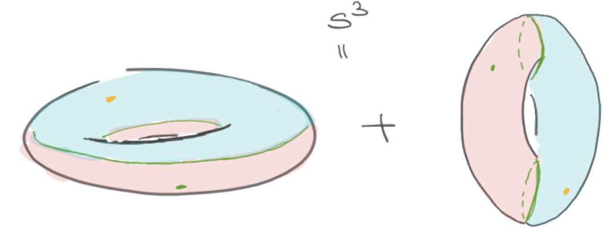

# Research

<!--  -->

My research is in the area of algebraic topology and homotopy theory. My broad
interests are in understanding how homotopy theoretic tools can be used
to solve problems from other areas of math.

## 2-groups in Equivariant Elliptic Cohomology

I got involved in this project thanks to an [MRC Workshop]. 2-groups are
higher categorical variants of groups. The goal of this project is to
find a 2-categorical interpretation of some of naturally occurring
objects (Drinfield double of a group) in mathematical physics and extend
them using ideas from Equivariant Elliptic Cohomology.

[mrc workshop]: http://www.ams.org/programs/research-communities/2019MRC-Geometry

## An application of the h-principle to Manifold Calculus

This was my PhD thesis. I applied homotopy theoretic techniques
to study problems for differential geometry. Here is [the paper] ([arXiv
version]) based on the [thesis].
Here are some notes [notes1], [notes2] from the talks I gave on this
topic.

[the paper]: https://doi.org/10.1007/s40062-020-00255-3
[arxiv version]: https://arxiv.org/abs/1711.07670
[thesis]: https://drive.google.com/file/d/1fHkImG-CTB2liHDIAo3YmzqBmN-Qibx6/view?usp=sharing
[notes1]: https://drive.google.com/file/d/1h8pHb-5HmM55_bwdzPYDB7cVHo4MHy-I/view?usp=sharing
[notes2]: https://drive.google.com/file/d/1D8TSRQFVUVjM3wQ74npbH2hibrHsDho_/view?usp=sharing

[lean theorem prover]: https://leanprover-community.github.io/
[mathcamp 2020]: https://apurvanakade.github.io/courses/lean_at_MC2020/

## Protein folding using Markov chains

During my undergrad, I briefly worked on a project involving some
protein folding models using basic linear algebra.
[Information Processing Letters, IPL4801].

[information processing letters, ipl4801]: https://drive.google.com/file/d/1xT6C4O_fMvpqoJCfnSq1ypeikM6XNMjw/view?usp=sharing

## Projects that did not quite work out

- 2-groups in HoTT
- Spectral lifts of Soergel bimodules, joint with V. Lorman
- Finding loop space structures in exotic Kac-Moody groups
- Equivariant Embedding Calculus
