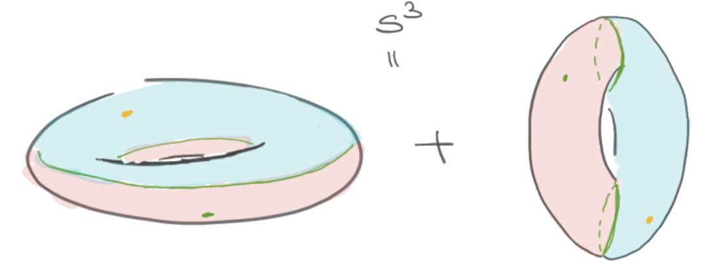

# Projects 

&nbsp;

## Teaching Projects

- **Directed Reading Program**
  
  The Directed Reading Program is a program for undergrads and grad students/postdocs.
  Undergrads are paired with a mentor whose interests align with theirs and they study a topic of their choice for one semester. 
  It is intended to help motivated students explore topics in more depth than possible in a classroom setting.
  I co-organize the [DRP at UWO] and in the past have co-organized the [DRP at JHU].
  Following is the list of projects I've mentored.
  -   Jacob Fabe, *Fundamental Group* from Topology by Munkres ([DRP, Fall
      2020])
  -   Tim Yau, *An Introduction to Manifolds* by Loring Tu. ([DRP, Fall
      2019][DRP, Fall 2020])
  -   Hannah Wool, *Topology* by Munkres. ([DRP, Spring 2019])
  -   Sydney Timmerman, [*Differential Geometry and Lie Groups for Physicists*] by Marián Fecko. ([DRP, Fall 2018])
  -   Eric Cochran, *An Introduction to Manifolds* by Loring Tu. ([DRP,
      Spring 2018])
  -   Chris Chia, *The Knot Book* by Adams Collins. ([DRP, Fall 2017])
  

- **Discrete math course - Fall 2020**
  
  Most of my time in Fall 2020 was spent designing and teaching an online Discrete Math course. 
  This involved making [youtube videos], making and editing [WeBWorK] problem sets, managing discussion forums, other standard course related chores, and not going insane.
  I occasionally write about it on my [my wordpress blog].

- **Canada/USA Mathcamp** 

  Canada/USA Mathcamp is a summer camp for mathematically talented students ages 13‑18 from all over the world. 
  Among other things, I have been designing and teaching some fun courses there.
  Notes for my courses can be found [here](#notes). I've also supervised the following reading projects:
    - Daniel Koizumi, [Riemann Surfaces](https://drive.google.com/file/d/1bv-dCvd4nwfD68RxDeuDFoJ3dZIOoqPq/view) from *Algebraic Curves and Riemann Surfaces* by Rick Miranda.
    - Kenji, Dedekind Domains in Lean and Michael, Konigsberg Bridge Problem in Lean ([code]).
    - Ezra Erives, *Differential Geometry and Lie Groups for Physicists* by Marián Fecko.
    - Edgar Wang, *Algebraic Topology* and Alan Yan, *Algebraic Topology* by Hatcher.
  

- **JHU Intersession courses** 

  I taught two week-long intersession courses titled Hitchhiker’s Guide to Algebraic Topology and Symmetries & Polynomials. I taught both of these courses in a flipped classroom format. I assigned students guided exercises, which they solved to learn more about the subject. 

  - *Hitchhiker’s Guide to Algebraic Topology*
  
    For Hitchhiker’s Guide to Algebraic Topology, I asked the students to read and present applications of algebraic topology to other fields of science of their choosing. We had several exciting conversations about things like applications of knot theory to protein folding and data science. The notes and the student presentations can be found [here](https://apurvanakade.github.io/courses/2017_h2g2_alg_top/index.html).
  
  - *Symmetries & Polynomials*

    In the Symmetries & Polynomials course, I taught group theory using permutations of elements and its connection to Galois theory using roots of polynomials. The problem sets for this course can be found [here](https://apurvanakade.github.io/teaching-portfolio/drive.google.com/file/d/1dChuk8J7s31C8xGurzsbf988VORnyXgb/view).

- **Honors Single Variable Calculus**
  
  At JHU, I designed and taught a full semester Honors Single Variable Calculus course for two semesters. 
  This was an experimental full semester four-credit course offered at JHU to first-year undergraduates. 
  The course covered all of the first-year calculus and introduced students to proof writing.
  This is the first course I had to design from scratch. 
  The materials for this course can be found [here](https://apurvanakade.github.io/courses/2018_Honors_Calc/).

## Research Projects

I work in the area of algebraic topology and homotopy theory. My broad
interests are in understanding how homotopy theoretic tools can be used
to solve problems from other areas of math. 

- **Proof Formalization**
  
  I have recently gotten interesting in teaching math to computers using [Lean](https://leanprover.github.io/about/).
  This is different from doing computations as here we are trying to teach math to computers the same way we understand it.
  
  I taught a course about it at [Mathcamp 2020]. 
  
  My primary interest in Lean is as a potential tool for teaching math proofs.
  My secondary interest lies in combining machine learning and theorem proving. 
  These are very long term goals as the field of theorem proving, although rapidly growing, is still very nascent.

- **2-groups in Equivariant Elliptic Cohomology**

  I got involved in this project thanks to an [MRC Workshop]. 2-groups are
  higher categorical variants of groups. The goal of this project is to
  find a 2-categorical interpretation of some of naturally occurring
  objects (Drinfield double of a group) in mathematical physics and extend
  them using ideas from Equivariant Elliptic Cohomology.

- **2-groups in HoTT**

  I\'m trying to understand how to express and analyze 2-groups in
  homotopy type theory. Homotopy type theory is a branch of logic that
  encored homotopy equivalences into one of its fundamental axioms thereby
  providing a natural formalism for describing homotopy theory.

- **An application of the h-principle to Manifold Calculus**

  This was my PhD thesis, in which I applied homotopy theoretic techniques
  to study problems for differential geometry. Here is [the paper] ([arXiv
  version]) based on the [thesis] [(Updated on: May 07, 2019)]{.small}.
  Here are some notes [notes1], [notes2] from the talks I gave on this
  topic.

- **Protein folding using Markov chains**

  During my undergrad, I briefly worked on a project involving some
  protein folding models using basic linear algebra.
  [Information Processing Letters, IPL4801].

- **Projects that did not quite work out**

  - Spectral lifts of Soergel bimodules, joint with V. Lorman
  - Finding loop space structures in exotic Kac-Moody groups
  - Equivariant Embedding Calculus

[youtube videos]: https://www.youtube.com/playlist?list=PLXAOfwfSuiKm3cL-JftD9ndrjYi7fPcqN
[WeBWorK]: https://webwork.maa.org/
[my wordpress blog]: https://notleftasanexercise.wordpress.com/category/discrete-math/

[code]: https://github.com/apurvnakade/mc2020-projects

[the paper]: https://doi.org/10.1007/s40062-020-00255-3
[arXiv version]: https://arxiv.org/abs/1711.07670 
[thesis]: https://drive.google.com/file/d/1fHkImG-CTB2liHDIAo3YmzqBmN-Qibx6/view?usp=sharing
[notes1]: https://drive.google.com/file/d/1h8pHb-5HmM55_bwdzPYDB7cVHo4MHy-I/view?usp=sharing
[notes2]: https://drive.google.com/file/d/1D8TSRQFVUVjM3wQ74npbH2hibrHsDho_/view?usp=sharing
[Information Processing Letters, IPL4801]: https://drive.google.com/file/d/1xT6C4O_fMvpqoJCfnSq1ypeikM6XNMjw/view?usp=sharing
[MRC Workshop]: http://www.ams.org/programs/research-communities/2019MRC-Geometry
[Lean theorem prover]: https://leanprover-community.github.io/
[Mathcamp 2020]: https://apurvanakade.github.io/courses/lean_at_MC2020/
[new mathematical content]: https://github.com/apurvnakade/mc2020-projects

[DRP at UWO]: https://www.math.uwo.ca/undergraduate/directed_reading_program.html
[DRP at JHU]: http://www.math.jhu.edu/drp.html
[DRP, Fall 2020]: https://www.math.uwo.ca/undergraduate/directed_reading_program.html
[DRP, Spring 2019]: http://www.math.jhu.edu/drp.html#Spring2019
[DRP, Fall 2018]: http://www.math.jhu.edu/drp.html#Fall2018
[DRP, Spring 2018]: http://www.math.jhu.edu/drp.html#Spring2018
[DRP, Fall 2017]: http://www.math.jhu.edu/drp.html#Fall2017
